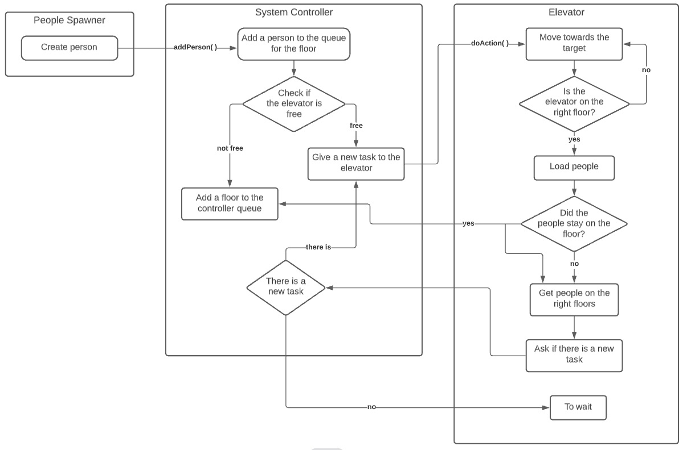

On each floor there are 2 queues of people (Queue<Person>): one up, one down. The controller has two queues of floors (Queue<Floor>), also in two directions.

People Spawner creates a person with random parameters and passes it to the System Controller. System Controller adds a person to the queue per floor. 
Then checks whether there is a free Elevator, if there is, then gives him the task to go to the floor of the person just transferred. 
If all the Elevators are occupied, then the controller adds a new person's floor in turn.

When one of the elevators is free, it asks the controller if it has a new task. The controller checks its queues and issues a new task to the elevator from the largest queue.

If the elevator could not load all the people from the queue on the floor, the System Controller adds this floor to the queue.

